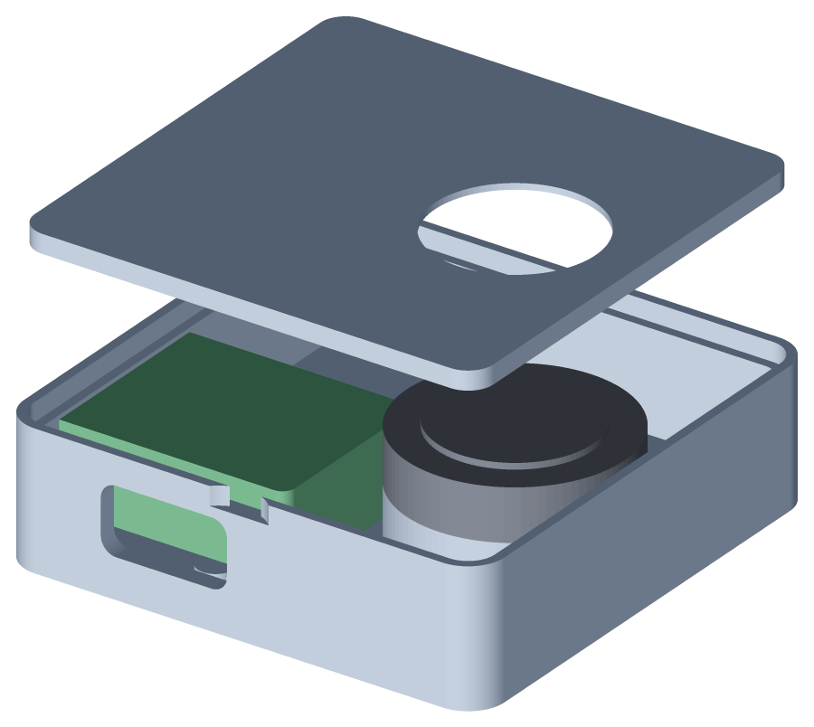
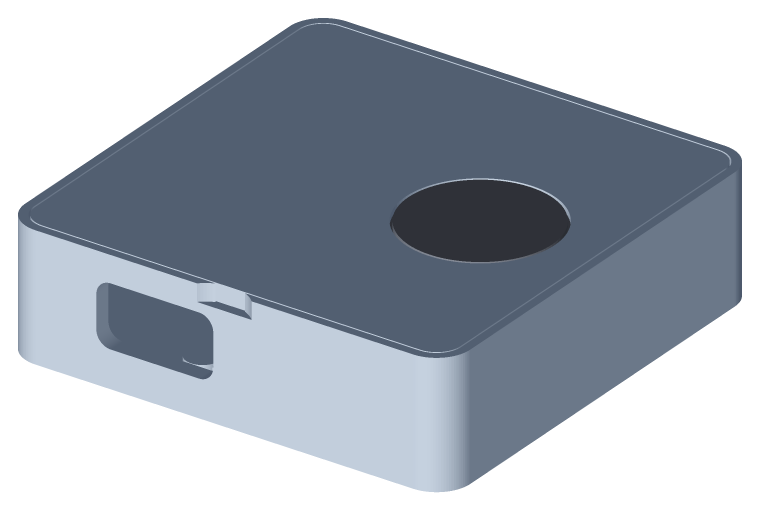

# Assembly



Order matters here: prove the electronics on the bench before anything goes
into a shell. You do not need a 3D printer for the first working prototype.

## 1. Wire it on the bench

Follow [hardware/wiring.md](../hardware/wiring.md) with the ESP32-S3, sensor,
USB cable and loose jumper wires. Leave the wires long for now; trim them only
after the firmware, enrolment and HID typing all work.

Keep the board on a non-conductive surface and check for exposed leads touching
each other before plugging it in.

## 2. Flash and prove it

```sh
cd firmware
pio run -e esp32s3 -t upload
pio device monitor
```

The console should greet you. Then:

```
fpkey> status
```

You want `sensor responding` and `usb hid enumerated`. If the sensor is silent,
stop here -- it is wiring, baud or module password, and none of those get easier
inside a box.

Enrol a finger and set a throwaway secret first:

```
fpkey> enroll
  [1/4] place finger
  [1/4] captured, lift finger
  ...
enrolled into slot 0

fpkey> secret test-password-123
stored, 17 characters
```

Now prove the HID path without involving your login password. Open a plain text
editor, focus it, and:

```
fpkey> test
typing in 3s -- focus a text field you can safely type into
```

If what appears is not what you typed, your Mac's keyboard layout is not US --
see [macos-setup.md](macos-setup.md#keyboard-layout).

Finally, touch the sensor. The LED should go white, then green, and the secret
should be typed into your editor.

## 3. Choose a shell

The printed enclosure is optional until the bench prototype works. A small
plastic electronics box is fine: drill one hole for the sensor face, one slot
for USB-C, and keep the sensor shoulder uncovered so your finger touches the
module directly.

If you are printing the included enclosure:

Both parts flat, no supports. Settings are in
[enclosure.md](enclosure.md#printing).

Before wiring anything, dry-fit the lid into the base. If it does not seat with
firm thumb pressure, adjust `fit.lid_clearance` and reprint the lid -- it is a
twenty-minute print and it is much easier to discover this now than with a
soldered assembly in your hand.

Drop the sensor into its ring seat and check that the lid's window leaves the
sensing face clear. If plastic overlaps the face, reduce `features.bezel_lip`.

## 4. Close it up

1. Trim the wires so the sensor reaches its seat with the board on its posts,
   leaving the ribbon a gentle bend rather than a fold. The 2 mm gap between the
   board pocket and the sensor pocket exists for that bend.
2. Lay the ribbon along the cavity floor and pass it through the notch in the
   ring seat, so it runs *under* the sensor.
3. Seat the board on its four posts, native USB-C facing its opening. The four
   corner ribs only fit one way round; if the board does not drop in flat, it is
   rotated.
4. Drop the sensor into the ring, face up.
5. Press the lid in from above. The sensor is captured between the ring and the
   lid's counterbore -- it should no longer move.



To open it again, get a fingernail into the scallop on the wall and lift.

## 5. Check it again

Plug it into the Mac and touch the sensor once more. Enclosing the sensor can
change how it reads: if matches got noticeably worse, the lid is pressing too
hard on the module. Increase `features.bezel_lip` clearance or add 0.2 mm to
`sensor.body_height` so the ring sits lower.

Then re-enrol. A finger enrolled on a bare module and used through a bezel is
presenting a slightly different contact area, and re-enrolling in the final
assembly is worth a surprising amount of match reliability.
