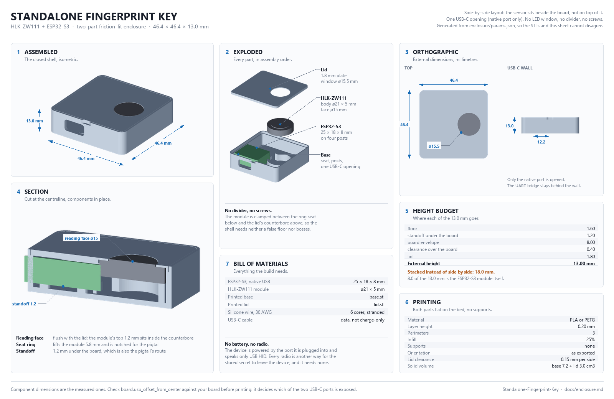
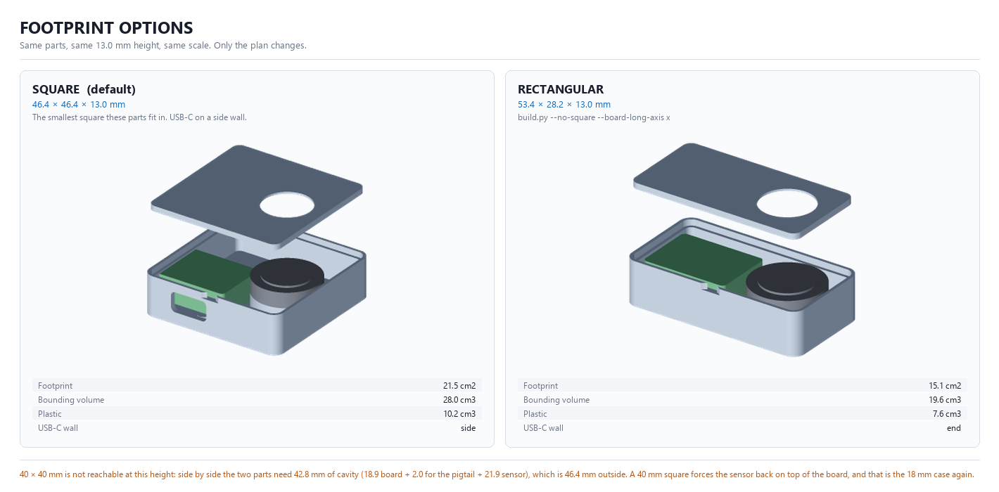
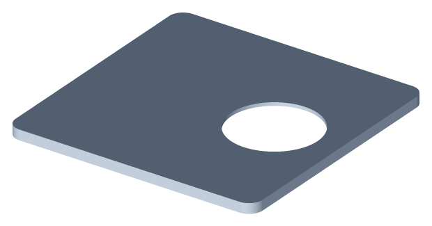

# Enclosure



External size **46.4 x 46.4 x 13.0 mm**. Two printed parts, no divider, no
screws, no inserts.

## Why it is 13 mm and not 18 mm

The first revision stacked the sensor on top of the ESP32-S3. That is the
obvious layout -- it keeps the footprint down to roughly the size of the board --
but it adds the two tallest things in the assembly together. Run the measured
parts through this model with that arrangement and it says **18.00 mm**, which is
exactly what the first revision measured. That is where the millimetres were
going, and it was never really the lid's fault:

```
floor 1.6 + board column 9.6 + sensor body 5.0 + lid 1.8  =  18.0 mm
```

Laying the parts side by side takes the sensor out of the vertical stack
entirely. The height becomes whichever single column is tallest, the lid stops
having to contain anything, and the screws go away with it -- a friction-fit lid
needs no bosses:

```
floor                         1.60
standoff under the board      1.20   also the route for the sensor's pigtail
board envelope                8.00   the ESP32-S3, all of it
clearance over the board      0.40
lid                           1.80
                            ------
                             13.00 mm
```

The lid went from 6.4 mm deep to a flat 1.8 mm plate. The cost is footprint: the
sensor now needs its own floor space, so the square grew from 40 mm to 46.4 mm a
side.

### The board is the floor of this design

Look at that budget again. **8 of the 13 mm are the ESP32-S3 module itself** --
more than the floor, the lid, the standoff and every clearance put together.
Nothing in the enclosure will beat that number.

If that 8 mm includes pin headers you are not using, desoldering them takes the
board to roughly 3.5 mm. Then the sensor becomes the tallest column instead, and
the whole shell drops to about **10.1 mm**. That is the single biggest lever
available, and it is not in this repository -- it is a soldering iron.

The sensor column, for comparison:

```
body above the counterbore   3.80   the top 1.2 mm sits inside the lid
pigtail thickness            1.20   the ribbon passes under the module
headroom                     0.50
                           ------
                             5.50 mm
```

`python enclosure/build.py` prints this budget every time it runs, so the number
is never stale.

## Footprint options



The height is fixed at 13 mm by the board. What is left to choose is the plan,
and `shell.board_long_axis` and `shell.square` in `params.json` cover it:

| | Size | Footprint | Plastic | USB-C |
| --- | --- | --- | --- | --- |
| **Square** (default) | 46.4 x 46.4 x 13.0 | 21.5 cm2 | 10.2 cm3 | side wall |
| **Rectangular** | 53.4 x 28.2 x 13.0 | 15.1 cm2 | 7.6 cm3 | end wall |

```sh
python enclosure/build.py                                     # square
python enclosure/build.py --no-square --board-long-axis x     # rectangular
```

Square is the default: it sits on a desk like a puck, and at 46.4 mm a side it is
7 mm shorter in its longest dimension than the rectangular version. The
rectangular one is smaller in every other measure -- a third less plastic, a
third less plan area -- and its port lands on the end, so it plugs in along its
own length like a USB stick. Neither is wrong; they are different objects.

**40 x 40 mm is not reachable at this height.** Side by side, the two parts need
42.8 mm of cavity -- 18.9 for the board, 2.0 for the pigtail's bend, 21.9 for the
sensor -- and 46.4 mm outside it. Fitting them into a 40 mm square means putting
the sensor back on top of the board, and that is the 18 mm case again. The
arithmetic does not bend.

Note what squaring it off does *not* do: the extra 17 mm of depth is empty. The
board sits against the wall its port opens through and the sensor sits beside it;
nothing fills the rest, because there is nothing to put there. That is the honest
trade -- you are buying a shape, not capacity. If the emptiness bothers you more
than the proportions do, build the rectangular version.

## How the parts fit together



The sensor is a sandwich. The ring seat in the base pushes it up; the lid's
counterbore pushes it down; the through window in the lid leaves the sensing
face completely uncovered.

That last part is not cosmetic. A capacitive fingerprint sensor reads the
difference in capacitance between ridges and valleys, and a layer of PLA between
finger and die kills the signal. The window is a real hole, and `bezel_lip` --
the ring of plastic that overlaps the module's shoulder and holds it down --
must land on the shoulder, never on the sensing face. It is the dimension most
likely to need changing for your module revision.

The ESP32-S3 rests on four posts rather than in a pocket. Posts print cleanly,
tolerate a PCB that is 0.2 mm off nominal, and leave the underside of the board
clear for the sensor's pigtail to pass beneath it. Four L-shaped ribs at the
pocket corners stop it sliding -- the posts carry the weight, the ribs hold the
position. The model only emits a rib where there is actually a gap between the
board and the wall, so in the wide layout the end wall does the job itself.

## Printing

| Setting | Value |
| --- | --- |
| Layer height | 0.2 mm |
| Perimeters | 3 |
| Infill | 25% |
| Supports | none |
| Orientation | both parts flat, as exported |

Nothing overhangs. The USB-C opening is a notch open at the top of the wall
rather than a hole in the middle of it, precisely so nothing has to bridge; the
lid closes it once fitted.

PLA is fine. PETG is better if the key will live in a bag, and it is more
forgiving of the friction fit, because it creeps slightly instead of cracking.

### If the lid does not fit

Open `fit.lid_clearance`. It is 0.15 mm per side, which is a firm push fit on a
well-tuned FDM printer and too tight on most others.

| Symptom | Change |
| --- | --- |
| Lid will not go in | `lid_clearance` to 0.25 |
| Lid falls out | `lid_clearance` to 0.10 |
| Lid goes in but will not come out | widen `features.pry_notch_width` |

Regenerate with `python enclosure/build.py` after any change.

## Parameters

Everything lives in [`enclosure/params.json`](../enclosure/params.json). The
keys beginning with `_` are documentation and are stripped before the model
sees them; every other key is consumed by `model.py`, so there are no dead
parameters to mislead you.

The ones worth knowing:

| Key | Effect |
| --- | --- |
| `board.height` | Sets the height of the whole enclosure. Nothing else comes close |
| `board.usb_offset_from_center` | Which of the two USB-C ports gets an opening |
| `sensor.body_diameter` | Sets the seat, the counterbore and the footprint |
| `sensor.active_area_diameter` | Sets the window; with `fit.window_clearance`, the hole |
| `sensor.active_area_height` | Caps `features.bezel_lip` -- the face must stay clear |
| `shell.board_long_axis` | Which wall the USB-C port opens through |
| `shell.square` | Pad the shorter axis to a square footprint |
| `shell.part_gap` | Space between board and sensor for the pigtail's bend radius |
| `fit.lid_clearance` | The fit of the lid |
| `features.bezel_lip` | Retention vs. how far the finger has to reach |

## Regenerating

```sh
pip install manifold3d numpy pillow

python enclosure/build.py     # writes enclosure/stl/*.stl and the height budget
python tools/render.py        # base.png, lid.png, exploded.png
python tools/assembly.py      # assembly.png, closed.png, with the components in
python tools/spec_sheet.py    # spec-sheet.png, the one-page drawing above
python tools/variants.py      # variants.png, the footprint comparison
```

Only `build.py` and `render.py` are needed to print the thing; the rest produce
the images in this file. Pillow is only a dependency of the last three.

`build.py` refuses to leave quietly if a check fails -- it exits non-zero and
tells you which dimension is now unbuildable. The geometry itself comes out of a
CSG kernel that only emits manifold solids, so a written STL is watertight by
construction; the checks are about the design being sensible, not the mesh being
valid.
